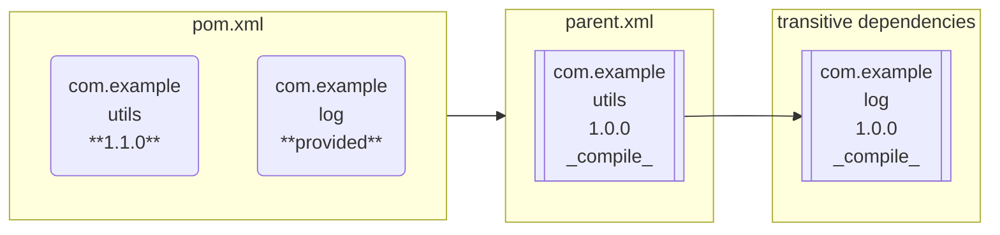

# maven-enforce-rule-no-overwrite-dependencies

Rule for [Maven Enforcer plugin](https://maven.apache.org/enforcer/enforcer-rules/) that verify that child POMs do
not overwrite dependencies from parent POM.

For example, we have dependency `com.example:utils:1.0.0` in parent POM:

```xml
...
<groupId>com.example</groupId>
<artifactId>parent</artifactId>
<version>1.0.0</version>
<packaging>pom</packaging>
...
<dependencyManagement>
    ...
    <dependencies>
        ...
        <dependency>
            <groupId>com.example</groupId>
            <artifactId>utils</artifactId>
            <version>1.0.0</version>
        </dependency>
        ...
    </dependencies>
    ...
</dependencyManagement>
...
```

This dependency have transitive dependency to `com.example:log:1.0.0`.

Now we create a child POM that uses parent POM and _by mistake_ redefine version of dependencies:

```xml
...
<parent>
    <groupId>com.example</groupId>
    <artifactId>parent</artifactId>
    <version>[1.0.0,2.0.0)</version>
</parent>
...
<groupId>com.example</groupId>
<artifactId>program</artifactId>
<version>1.0.0</version>
...
<dependencies>
    ...
    <dependency>
        <groupId>com.example</groupId>
        <artifactId>utils</artifactId>
        <version>1.1.0</version> <!-- This is should be skipped. -->
    </dependency>
    ...
    <dependency>
        <groupId>com.example</groupId>
        <artifactId>log</artifactId>
        <version>provided</version> <!-- This should not be defined: came as transitive dependency. -->
    </dependency>
    ...
</dependencies>
...
```

Scheme looks like this:



This rule show error that will help to fix that problem:

```xml
...
<parent>
    <groupId>org.company</groupId>
    <artifactId>parent</artifactId>
    <version>[1.0.0,2.0.0)</version>
</parent>
...
<groupId>com.example</groupId>
<artifactId>program</artifactId>
<version>1.0.0</version>
...
<dependencies>
    ...
    <dependency>
        <groupId>com.example</groupId>
        <artifactId>utils</artifactId>
    </dependency>
    ...
</dependencies>
...
```

## How to use

To add this rule to your project add following rule in
[Maven Enforcer plugin](https://maven.apache.org/enforcer/enforcer-api/writing-a-custom-rule.html#using-custom-rule):

```xml
...
<build>
    ...
    <plugins>
        <plugin>
            <groupId>org.apache.maven.plugins</groupId>
            <artifactId>maven-enforcer-plugin</artifactId>
            <version>3.5.0</version>
            <dependencies>
                <dependency>
                    <groupId>pro.zavodnikov.maven.rule</groupId>
                    <artifactId>no-overwrite-dependencies</artifactId>
                    <version>1.0.0</version>
                </dependency>
            </dependencies>
            <executions>
                <execution>
                    <id>enforce-rules</id>
                    <goals>
                        <goal>enforce</goal>
                    </goals>
                </execution>
            </executions>
            <configuration>
                <!--
                    See:
                        https://maven.apache.org/enforcer/enforcer-rules/
                -->
                <rules>
                    <noOverwriteDependencies />
                </rules>
            </configuration>
        </plugin>
    </plugins>
    ...
</build>
...
```

## License

Distributed under MIT License.
