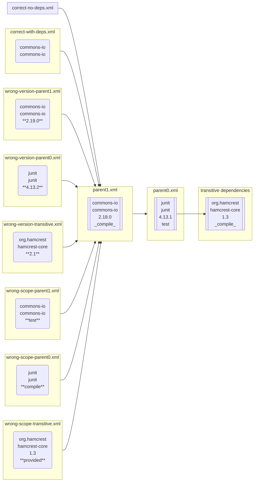

# POM examples

This directory contain test examples of POM files.

POMs that should not failed starts with `correct-` prefix. POMs with errors starts with `wrong-` prefixes.

Folder `repository` contain fake repository for unit-testing.

## Common scheme



## Run

```sh
$ mvn -f SOME_FILE.xml verify
```
